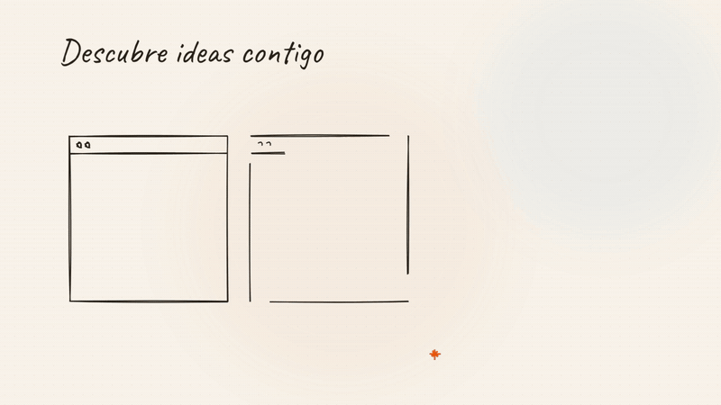

# 🎨 AI Frontend Guide Kit

🌐 **English** · [Español](README.es.md)

**Reuse-first UI catalog + guided workflow for AI agents building frontends.**
This repository is both the 🏭 **factory** (extraction pipeline + catalog) and the 📦 **distributable kit** you drop into any frontend project.

## 🎬 Presentation — 55 seconds

<p align="center">
  <a href="media/explainer/video/ai-frontend-guide-kit-es.mp4">
    
  </a>
</p>

<p align="center">
  <b>Reuse-first catalog, interactive reference discovery (example sites, likes, screenshots), the three phases and the selection memory — with friendly voice-over.</b><br><br>
  ▶️ <a href="media/explainer/video/ai-frontend-guide-kit-es.mp4">Español</a> ·
  <a href="media/explainer/video/ai-frontend-guide-kit-en.mp4">English</a> ·
  🖋 <a href="media/explainer/guion.md">Storyboard</a> ·
  🎛 <a href="media/explainer/index.html">Animation source</a>
</p>

## ✨ What's inside

| | What | Details |
|---|---|---|
| 📚 | **Catalog** | 34 verified sources · 4,287 reusable entries · 21 categories · quality score, per-entry licenses and install commands · React, Vue and Svelte · offline `explorer.html` |
| 🧭 | **Guided kit** (`ai-frontend-guide-kit/`) | `AGENTS.md` + router + 3-phase workflow in 11 short guides (00–11) + `find`/`get` query tools. Self-contained: no build, no npm dependencies |
| 🧠 | **Agent skills** | `ai-frontend-guide` (workflow), `frontend-polish` (phase 3), `ux-map` (visual screen map) and 16 vendored UX skills (`userflow` + 15 `flow-*`, MIT) |
| 💾 | **Selection memory** | `ai-frontend-output/`: append-only decision history, styles/components summary and reusable combinations |
| 🛡️ | **Audits** | `audit-honesty` (deceptive patterns), `audit-a11y` (axe + WCAG 2.2), `audit-perf` (Lighthouse vs Core Web Vitals) in `ai-frontend-guide-kit/tools/` |
| 🔒 | **Laya (optional)** | Local decision engine that ranks catalog candidates with calibrated probabilities — everything runs on your PC |

## 🔄 The three-phase workflow

| Phase | What happens | You get |
|---|---|---|
| **1 · 🧠 UX & theory** | Experience direction (`experience/` + Laya for questions/direction), interactive discovery loop (example sites, likes, screenshots, component combinations), then proven flows (`userflow` + `flow-*`) and design tokens | `EXPERIENCE-BRIEF.md` · `PRODUCT.md` · `UX-SPEC.md` · `flow-report.html` · `ux-map.excalidraw` · `DESIGN.md` + theme |
| **2 · 🧩 Composition** | Inventory → catalog search → reuse/adapt/build decision → install | Components adapted to your tokens |
| **3 · ✨ Total polish** | External audits (`impeccable`, taste-skill, emilkowalski) + Playwright MCP loop + `@playwright/test` regression | A screen ready to ship |

> 🔀 The phases are **entry points, not a strict pipeline**: the agent asks what you want — new frontend, small change, custom addition, polish only, UX only — and enters exactly where it fits.

## 🚀 Quickstart

### Option A · as a dependency (recommended)

```bash
npm i -D github:urben88/ai-frontend-guide-kit    # pin a version if you want: #v1.2.0
npx ai-frontend-guide-kit                        # explicit, idempotent setup
```

Optional: add `"kit": "ai-frontend-guide-kit"` to your scripts and run `npm run kit` after updating.
There is **no `postinstall`** — plain `npm install` never mutates your project.

### Option B · one-shot (no dependency)

```bash
npx github:urben88/ai-frontend-guide-kit
```

### 🎛️ Flags

| Flag | Effect |
|---|---|
| `--no-skills` | kit + docs only, no skills at all |
| `--no-design-skills` | skip the 3 external design skills (impeccable/taste-skill/emilkowalski) |
| `--no-mcp` | skip the Playwright + Excalidraw MCP configuration |
| `--with-laya` | also install/update Laya |
| `--target <dir>` | install into another folder |
| `--skills-mode cli` | legacy full CLI flow (lockfile + multi-agent links) |

### 📦 Offline / no git

```bash
npm pack                                  # -> ai-frontend-guide-kit-1.2.0.tgz (~0.3 MB, includes skills)
npx ./ai-frontend-guide-kit-1.2.0.tgz     # run it in the destination project
```

Then tell your agent:

> *"Read `ai-frontend-guide-kit/AGENTS.md` and follow its workflow."*

## 🔎 Finding components

```bash
node ai-frontend-guide-kit/tools/find.mjs --text "pricing toggle" --stack react --licensed --min-quality 70
node ai-frontend-guide-kit/tools/find.mjs --category forms --stack vue            # Vue / Svelte ports included
node ai-frontend-guide-kit/tools/find.mjs --source reactaria --category forms       # accessible primitives
```

Results are ranked by **quality** (license clarity, install effort, dependency weight, source maintenance) or by weighted text relevance; near-identical entries across sources are collapsed (`--all` shows them) and icons are hidden unless asked. Open `ai-frontend-guide-kit/catalog/explorer.html` for an offline, filterable catalog with preview links and copy-install buttons.

## 🛠️ What the installer does

1. 📁 Copies `ai-frontend-guide-kit/` into the target project (removes the legacy `ai-frontend-guide/` if present).
2. 📌 Adds the intake pointer to the project's `AGENTS.md` (ask first, then route through the three phases).
3. 💾 Creates `ai-frontend-output/` (selection memory) if missing — never removed on refresh.
4. 🧩 Installs the **19 skills of this repo** into `.agents/skills/` (clean: no lockfile, no symlink sprawl) plus the **16 external design skills** via their CLI by default. If the project has `.claude/`, the 19 are linked into `.claude/skills/`.
5. 🎭 Configures the **Playwright + Excalidraw MCP** servers per detected harness (`.mcp.json` for Claude Code, `opencode.json` for OpenCode) and creates the `ai-frontend-output/ux/ux-map.excalidraw` scaffold; otherwise prints the exact commands. Browser once: `npx playwright install chromium`.
   - 🖱️ **Optional — Agentation** (click an element in your React app and tell the agent exactly what to change; guide `11-VISUAL-FEEDBACK.md`). The installer only prints the message, it does not install it: `npm install agentation -D`, `claude mcp add agentation -- npx -y agentation-mcp server`, `npx agentation-mcp doctor`, and mount `<Agentation endpoint="http://localhost:4747" />` in dev only.
6. 🐍 Checks Python/Laya and prints the exact next step.

> 💡 External skills need network; if they fail the install continues and the kit still works with `find`/`get`.

## 💾 Selection memory (`ai-frontend-output/`)

Every component decision is recorded, so each project keeps an auditable history and reusable combinations:

```bash
node ai-frontend-guide-kit/tools/memory.mjs combo list       # check saved combinations before searching
node ai-frontend-guide-kit/tools/memory.mjs add --screen landing --block hero --need "..." \
  --decision reuse --id <entry-id> --style gradient,dark
node ai-frontend-guide-kit/tools/memory.mjs combo save saas-landing-v1 --note "landing SaaS minimalista"
node ai-frontend-guide-kit/tools/memory.mjs combo show saas-landing-v1   # entries + install commands
node ai-frontend-guide-kit/tools/memory.mjs combo apply saas-landing-v1  # reuse in another project
```

The folder holds `selections.jsonl` (history), `combinations.json` (named sets) and `SUMMARY.md` (generated summary).
It lives outside the kit so refreshes never touch it; share combinations across projects by copying `combinations.json` or pointing `AI_FRONTEND_OUTPUT` to a shared folder.

## 🔒 Laya (local decision engine, optional)

Laya is a fast, non-autoregressive decision model with calibrated probabilities. Here it ranks the **next adaptive question**, the **experience direction** (archetypes/philosophies/styles) and **component candidates**; licenses, install commands and manifest fields always come from the catalog/manifest.

```bash
python ai-frontend-guide-kit/tools/laya_select.py --check       # status (exit 0 = ready)
python ai-frontend-guide-kit/tools/laya_select.py --install     # pip install -U laya (first run downloads checkpoints)
python ai-frontend-guide-kit/tools/laya_select.py --need "..." --dry-run   # preview the payload, no model
# after asking the user once per session:
python ai-frontend-guide-kit/tools/laya_select.py --dataset experience --kind question \
  --task next-question --context-file ai-frontend-output/ux/EXPERIENCE-BRIEF.md --confirmed
python ai-frontend-guide-kit/tools/laya_select.py --dataset experience --kind archetype \
  --task direction --context-file ai-frontend-output/ux/EXPERIENCE-BRIEF.md --confirmed
python ai-frontend-guide-kit/tools/laya_select.py --need "pricing table with monthly/anual toggle" --category pricing --commercial \
  --direction <experience-id> --context-file ai-frontend-output/ux/EXPERIENCE-BRIEF.md --confirmed
```

El ranking de componentes acepta `--direction <id>` (la dirección elegida del brief) como contexto, para que el encaje coincida con el UX definido; sin Laya, `find`/`get` y las heurísticas siguen bastando.

⚠️ The agent **must ask before using it**: consent is once per project/session (recorded in `EXPERIENCE-BRIEF.md`) and `--confirmed` is required per call as proof (without it the script exits with code 3 and loads nothing). Everything runs locally — no server, no external APIs beyond the one-time Hugging Face checkpoint download. Without Python/Laya the kit still works via the question tree and `find.mjs` + `get.mjs`.

## 📂 Repository layout

```
├── ai-frontend-guide-kit/        # 📦 the distributable kit (copy this)
│   ├── AGENTS.md · README.md · VERIFICATION.md
│   ├── guides/00..10         # experience direction + reuse-first UX/UI workflow (00 = router, 01 = direction, 02 = flows, 10 = iteration)
│   ├── experience/           # archetypes, philosophies, styles, question bank, discovery loop, reference cards + experience-manifest.json
│   ├── catalog/              # index + taxonomy + install-guides + 34 sources + explorer.html + license-report.md
│   └── tools/                # context · find · get · memory · laya_select · excalidraw-mcp · audit-honesty · audit-a11y · audit-perf
├── skills/                   # ai-frontend-guide + frontend-polish + 16 vendored UX flow skills (MIT)
├── manifest/                 # catalog source of truth (generated)
├── media/explainer/          # 🎬 hand-drawn explainer: index.html + render.mjs + video (ES/EN, GIF, poster)
├── tools/                    # extraction/refresh/build/validate/quality/licenses pipeline
├── tests/                    # node:test suite (find/get/install/memory/audits/walkthrough)
├── examples/walkthrough/     # the three phases on a tiny project (also a regression fixture)
├── .github/workflows/        # CI, monthly refresh PR, monthly link check
├── openspec/                 # change specs (OpenSpec)
└── install.mjs               # one-command installer (bin)
```

## 🧑‍🔧 Maintainer commands

```bash
node tools/refresh.mjs <source_id>   # refresh one source (or "all")
node tools/build-index.mjs           # rebuild the light index
node tools/build-kit.mjs             # re-sync catalog into ai-frontend-guide-kit/
node tools/sync-ux-skills.mjs        # re-vendor the 16 UX skills (MIT); --check for updates
node tools/validate.mjs              # schema + ID + index checks
node tools/validate.mjs --urls 100   # stratified link check (fails above 10% broken)
node tools/quality.mjs               # recompute quality scores (also run by build-index)
node tools/check-licenses.mjs        # compare declared licenses with repo LICENSE files (--apply upgrades unknown)
node tools/audit-categories.mjs      # category sanity audit (--strict for CI)
node tools/build-explorer.mjs        # regenerate catalog/explorer.html (also run by build-kit)
npm test                             # test suite
npm run verify                       # validate + build-kit + tests
```

## ⚖️ Licensing

- 🧾 The tooling and documentation in this repository follow their own licenses; check `openspec/` history for decisions.
- 📜 Catalog entries inherit the license of their source (`license_type`, `commercial_use`, `limits`). Non-commercial entries (e.g. original Agents Kit families) are flagged and must not be used in commercial work.
- 🚫 The kit stores metadata and links only — never third-party component code.
